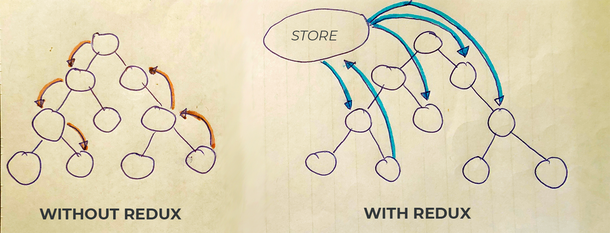

Last year, I've discovered many new libraries that are related to React.
It's especially due to the fact I didn't have previous experience and also javascript is
such fast programming language with a lot of libraries released every day.
On this blog, I would like to describe my experience with React and also bring you closer to what I think:
What do I see and consider today to be necessary when working with React? Libraries can help those who start with it.
I started with React at the official [tutorial](https://reactjs.org/tutorial/tutorial.html) from Facebook.
After you understand the basic terms and find out how to [structure the React project](<(https://reactjs.org/docs/faq-structure.html)>), then you need to get some background to the current popular libraries. Here is the list of libraries I find important.

> Don’t overthink it.
> If you’re just starting a project, don’t spend more than five minutes on choosing a file structure.
>
> <cite>React</cite>

## Boilerplate

[create-react-app](https://github.com/facebook/create-react-app) -
if you do not have a React experience, this library will create a boilerplate for your application. It contains all the necessary configurations and dependencies, so you can write React and do not have to worry about anything.
In the beginning, you do not have to know so many tools and connections. This utility will take care of it.

```no-text
What's included? React, JSX, ES6, TypeScript and Flow syntax support.
```

## State Container

[Redux](https://github.com/reduxjs/react-redux) - this is _a global store with variables_. Why? You do not have to send the variable through other _x_ components to depth. Instead, you connect it to the global store.
It is commonly used in applications. For example user data, current theme, application status, ...
I recommend installing the [plugin](<(https://chrome.google.com/webstore/detail/redux-devtools/lmhkpmbekcpmknklioeibfkpmmfibljd?hl=en)>) to develop into Chrome.
If you want to avoid a boilerplate (without shares, switches, ...) which are associated with Redux, I recommend [rematch](https://github.com/rematch/rematch).



[React Context](https://reactjs.org/docs/context.html) - it's a relatively new feature in React. It is the theoretical replacement for Redux.
**Concept:** The `provider` is set up and his internal components can be read by the `consumer`.


[MobX](https://github.com/mobxjs/mobx) - another option for state container.

## Storage

[store.js](https://github.com/marcuswestin/store.js/) - Helps with local storage-based applications. Older iPhones do not support it 😅.

## Server Communication

[fetch](https://developer.mozilla.org/en-US/docs/Web/API/Fetch_API) - native command from ES6 which can query the server.
Some features such as **abort** are missing.

[Axios](https://github.com/axios/axios) - an extended version of **fetch**, based on XMLHttpRequests.

```javascript{numberLines: true}
const axios = require('axios')
axios
  .get('/user?ID=12345')
  .then(function(response) {
    console.log(response)
  })
  .catch(function(error) {
    console.log(error)
  })
```

[Ky](https://github.com/sindresorhus/ky) - my colleague advised me the work with this library, which is based on fetch. Comparison of Axios vs. Ky:

> Yes. Axios is based on XMLHttpRequests, while Ky is based on Fetch. Axios has manually implemented a lot of things we get for free with Fetch. Fetch-based libs should be more stable and less buggy in general. Ky also has retry functionality.
>
> <cite>[Sindre Sorhus](https://twitter.com/sindresorhus/status/1037763588826398720)</cite>

[Apollo Client](https://github.com/apollographql/apollo-client) - Fully supported library for [GraphQL](https://graphql.org/). It also offers [dev tools](https://chrome.google.com/webstore/detail/apollo-client-developer-t/jdkknkkbebbapilgoeccciglkfbmbnfm) for Chrome. I recommend looking at it.
**GraphQL** at a glance: Multiple queries can be merged into one, or instead of chain calls to the server, they can be replaced by one.


## CSS

[Styled Components](https://github.com/styled-components/styled-components) - visualization of components in javascript using CSS. An advantage, for example: is to avoid class-name conflicts.

```javascript{numberLines: true}
const Button = styled.a`
  display: inline-block;
  color: #e62076;
`
render(<Button href="http://www.martinboksa.eu/">GitHub</Button>)
```

[CSS-in-JS](https://cssinjs.org/) - a similar library like _Styled Components_, we use it at work.

[classnames](https://github.com/JedWatson/classnames) - I've put it in CSS category, but it's a utility that helps create class-names for components. It's one of my most favorite tools. I think the code is much cleaner.

```javascript
classNames('foo', { bar: true }) // => result class name: 'foo bar'
```

[react-responsive](https://github.com/contra/react-responsive) - a simple way to use the media query in React to create a responsive web.

```javascript{numberLines: true}
import MediaQuery from 'react-responsive'
const Example = () => (
  <div>
    <div>Device Test!</div>
    <MediaQuery query="(min-device-width: 1824px)">
      <div>You have a huge screen</div>
    </MediaQuery>f<MediaQuery query="(max-width: 1224px)">
      <div>You are sized like a tablet or mobile phone though</div>
    </MediaQuery>
  </div>
)
```

[React DnD](https://github.com/react-dnd/react-dnd) - library to create a Drag & Drop interface.

[react-beautiful-dnd](https://github.com/atlassian/react-beautiful-dnd) - at work, guys have an excellent experience with this _DnD_.

> it has great performance.
> have plenty of examples to cover most of the basic cases.
>
> <cite>Denis Slávik</cite>

[React Spring](https://github.com/react-spring/react-spring) - animation library. I have a very good experience with the performance it can achieve. I recommend looking at ["Why does React need another animation library?"](https://blog.usejournal.com/why-react-needed-yet-another-animation-library-introducing-react-spring-8212e424c5ce).


[Semantic UI](https://semantic-ui.com/) - UI framework to create a responsive web. Contains completed components.

[Carbon Components](http://react.carbondesignsystem.com/) - Collection of different UI components from IBM.

[Fabric](https://developer.microsoft.com/en-us/fabric#/components) - Various components from Microsoft.

_There are missing libraries like React Bootstrap or Material UI, libraries were selected so that you could create a nice web as simple as possible 📚._

## Internationalization

[React Intl](https://github.com/yahoo/react-intl) - a translation library that also provides formatting of dates, numbers, strings, pluralizations, ...

[react-i18next](https://github.com/i18next/react-i18next) - internationalization for _reactjs_ / _reactnative_, which is based on i18next.

[React Intl Redux](https://github.com/ratson/react-intl-redux) - translations are kept in redux store.

[FBT](https://facebookincubator.github.io/fbt/) - a framework for translation, used in Facebook.

_In this part, I wrote mainly from the experience of my colleagues._

## Testing

[Jest](https://jestjs.io/en/) - test platform with zero configuration. It is also used on _Facebook_.

[Enzyme](https://github.com/airbnb/enzyme) - a test tool from _Airbnb_.

## Meta Tags

[React Document Title](https://github.com/gaearon/react-document-title) - set `javascript÷document.title`.

[React Helmet](https://github.com/nfl/react-helmet) - tool for `html÷<head>` management.

## Forms

[Redux Form](https://github.com/erikras/redux-form) - State of forms is in the state container. Need to know [HOC](https://reactjs.org/docs/higher-order-components.html) and [Redux](https://github.com/reduxjs/react-redux).

[Formik](https://jaredpalmer.com/formik) - complete solution for forms, including validation, ... One of the most popular solutions.

## Utilities

[lodash](https://lodash.com/docs/4.17.11) - Extends javascript with many interesting functions like _debounce_.

[Moment.js](https://momentjs.com/) - parsing, manipulating, and displaying the date and time 📅. There are many more options to work with the date.
I think it's [not a good utility](https://hackernoon.com/why-you-should-choose-date-fns-over-moment-js-in-your-nodejs-applications-116d1a709c43). But it is popular and known in the world of javascript.

[date-fns](https://date-fns.org/) - instead of _momentjs_ you can use this library.

> Good library if you’re looking to replace Moment.js for one reason or another. Immutable too.
>
> <cite>[Dan Abramov](https://twitter.com/dan_abramov/status/805030922785525760?lang=en)</cite>

## Rich Editor

[Draft.js](https://github.com/facebook/draft-js) - a framework which creates a _rich editor_.


## Type Checking

[PropTypes](https://www.npmjs.com/package/prop-types) - check _props_ in runtime.

[flow](https://flow.org/en/docs/frameworks/react/) - static typechecker.

[TypeScript](https://www.typescriptlang.org/) - a language that translates into javascript but has types. I recommend seeing it.

## Nice to know

[Storybook](https://github.com/storybooks/storybook) - developer interface for UI Components. You see how your components look (imo, components can be simple reused and tested). A nice example of using [here](https://saurabhnemade.github.io/react-twitter-embed/?selectedKind=Twitter%20Timeline%20Embed&selectedStory=Timeline%20Profile%20%28With%20Screen%20Name%29&full=0&addons=1&stories=1&panelRight=1&addonPanel=storybook%2Factions%2Factions-panel).


[Prettier](https://prettier.io/) - one of my favorite tools. It's a code formatter and is integrated into all well-known editors. Just press the shortcut key to format the document.

[ESLint](https://eslint.org/) - _The pluggable linting utility for JavaScript and JSX._
I used it in all my javascript projects. Sometimes it's annoying.

[TSLint](https://palantir.github.io/tslint/) - As ESLint but for TypeScript to static code analysis.

[PixiJS](http://www.pixijs.com/) - Last year I was working on graphical editor based on React and PixiJS. I can fully recommend both.

[Gatsby](https://www.gatsbyjs.org/) - helps to create pages without _"a headache"_. For example, this technology has been used in [React Docs](https://reactjs.org/docs/getting-started.html) or in this blog.

[SENTRY](https://sentry.io/welcome/) - the tool I used to capture bugs in production. I can recommend it. Suitable to combine perfectly with React, especially when adding [Error Boundaries](https://reactjs.org/docs/error-boundaries.html) in the `javascript÷componentDidCatch()` method.

---

There are lot of libraries and utilities we can use to work with React and javascript. I think this is just a fraction of the list that could be useful to you. You can see more libraries [here](https://github.com/brillout/awesome-react-components).
The libraries you choose are up to you. It depends on what you want to achieve. All libraries are _opensource_ and if necessary, the redesign may not be so demanding.

When I was writing the blog, I was thinking about who will read this article. I finally decided to dedicate it to people who do not have a great experience with React. Consequently, I did not to describe the tools like _webpack_, _parcel_, _grunt_, ... I think these are things that are not necessary at the beginning.
