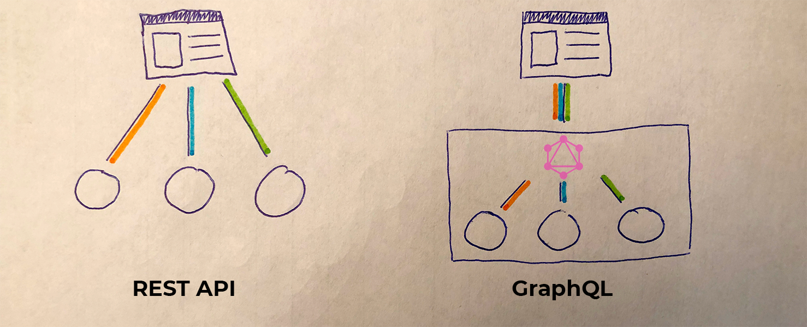
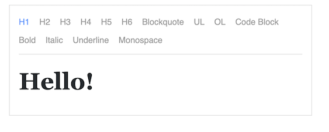

Za posledn칳 m칪j rok som sa stretol s mno쬽tvom kni쬹칤c, ktor칠 sa t칳kaj칰 Reactu.
Je to dan칠 najm칛 t칳m, 쬰 som nemal ve쬶칠 predch치dzaj칰ce sk칰senosti s Reactom
a z치rove켿 javascript je tak r칳chly jazyk, 쬰 vych치dz치 v 켿om ka쬯칳 de켿
nov칠 mno쬽tvo kni쬹칤c.
R치d by som si tu odlo쬴l doteraj코ie sk칰senosti a pribl칤쬴l v치m 캜o v코etko pova쬿jem
dnes za nevynutn칠 vedie콘 pri pr치ci s Reactom. Kni쬹ice m칪쬿 pom칪c콘 hlavne t칳m, ktor칤
s n칤m za캜칤naj칰.

## Boilerplate (Kostra)

[create-react-app](https://github.com/facebook/create-react-app)
ak nem치te sk칰senosti s Reactom, t치to kni쬹ica v치m vytvor칤 boilerplate (alebo kostru) pre va코u
aplik치ciu. Obsahuje v코etky nevyhnut칠 konfigur치cie a z치vislosti aby ste mohli
rovno p칤sa콘 React a nemuseli sa o ni캜 stara콘.

```no-text
What's included? React, JSX, ES6, TypeScript and Flow syntax support.
```

## Data Store

[Redux](https://github.com/reduxjs/react-redux) ide o glob치lny obchod s premenn칳mi. Je vhodn칳 k tomu,
aby ste nemuseli preposiela콘 premenn칰 cez 캞al코칤ch _x_ komponent do h컄bky. Tak ju
napoj칤te na glob치lne obchod. Pou쬴tie napr칤klad: user data, aktu치lna t칠ma, stav aplik치cie, ...
Pou쮂셨a sa 캜asto. Odpor칰캜am si doin코talova콘 na v칳vijanie [plugin](https://chrome.google.com/webstore/detail/redux-devtools/lmhkpmbekcpmknklioeibfkpmmfibljd?hl=en) do chrome.
Ak sa chcete vyhn칰콘 boilerplate, ktor칳 je spojen칳 s Reduxom, odpor칰캜am [rematch](https://github.com/rematch/rematch).


[React Context](https://reactjs.org/docs/context.html) je to pomerne nov치 feature od Reactu.
Je teoretick칳m nahradite쬺m Reduxu. Tu sa, ale vytvor칤 `provider` d치t a
jeho vn칰torn칠 komponenty vo vn칰tri ich vedia 캜ita콘 pomocou `consumera`.


[MobX](https://github.com/mobxjs/mobx) 캞al코ia mo쬹os콘 k uskladneniu
glob치lnych d치t.

## Serverov치 komunik치cia

[fetch](https://developer.mozilla.org/en-US/docs/Web/API/Fetch_API) nat칤vny pr칤kaz z ES6,
ktor칳m je mo쬹칠 dopytova콘 server. Funguje pomocou **Promise**, ale ch칳baj칰 mu zatia
nejak칠 funkcie ako napr칤klad **abort**.

[Axios](https://github.com/axios/axios) roz코칤ren치 verzia **fetch**, zalo쬰n치 tie
na **Promise**.

```javascript{numberLines: true}
const axios = require('axios')
axios
  .get('/user?ID=12345')
  .then(function(response) {
    console.log(response)
  })
  .catch(function(error) {
    console.log(error)
  })
```

[Apollo Client](https://github.com/apollographql/apollo-client) kni쬹ica s plnou podporou
pre [GraphQL](https://graphql.org/). Pon칰ka tie [dev tools](https://chrome.google.com/webstore/detail/apollo-client-developer-t/jdkknkkbebbapilgoeccciglkfbmbnfm) pre Chrome.
Odpor칰캜am si to pozrie콘. **GraphQL** v skratke: Viacero dopytov je mo쬹칠 zl칰캜i콘 do jedn칠ho.
Alebo namiesto re콘azov칳ch volan칤 na server, je mo쬹칠 ich nahradi콘 za jeden.



## CSS

[Styled Component](https://github.com/styled-components/styled-components) vizualiz치cia
komponentov v javascripte pomocou CSS. V칳hodou je napr칤klad vynutie sa class-name konfliktov.

```javascript{numberLines: true}
const Button = styled.a`
  display: inline-block;
  color: #e62076;
`
render(<Button href="http://www.martinboksa.eu/">GitHub</Button>)
```

[Material UI](https://github.com/mui-org/material-ui) React
komponenty, ktor칠 implementuj칰 [Google Material dizajn](https://material-ui.com/).

[classnames](https://github.com/JedWatson/classnames) zaradil som to do CSS, ale ide sk칪r
o utilitu, ktor치 pom치ha vytv치ra콘 class-names pre komponenty. Je to jeden z moj칤ch
najob쮂죡enej코칤ch n치strojov. Pod쬬 m켿a v칳borne zpreh쬬dn칤 k칩d.

```javascript
classNames('foo', { bar: true }) // => result class name: 'foo bar'
```

[react-responsive](https://github.com/contra/react-responsive) jednoduch칳 sp칪sob ako pou쬴콘
media query v Reacte.

```javascript{numberLines: true}
import MediaQuery from 'react-responsive'
const Example = () => (
  <div>
    <div>Device Test!</div>
    <MediaQuery query="(min-device-width: 1824px)">
      <div>You have a huge screen</div>
    </MediaQuery>
    <MediaQuery query="(max-width: 1224px)">
      <div>You are sized like a tablet or mobile phone though</div>
    </MediaQuery>
  </div>
)
```

[React DnD](https://github.com/react-dnd/react-dnd) kni쬹ica k vytvoreniu
Drag&Drop rozhrania.

[React Spring](https://github.com/react-spring/react-spring) kni쬹ica na anim치cie. M치m ve쬸i dobr칰 sk칰senos콘 s v칳konom
ak칳 je mo쬹칳 s 켿ou dosiahn칰콘. Odpor칰캜am
si pozrie콘 [_"Pre캜o React potrebuje 캞al코iu kni쬹icu na anim치cie?"_](https://blog.usejournal.com/why-react-needed-yet-another-animation-library-introducing-react-spring-8212e424c5ce).


[React Bootstrap](https://github.com/react-bootstrap/react-bootstrap) komponenty
na z치klade [Bootstrap 4](https://getbootstrap.com/).

## Internationalization

[React Intl](https://github.com/yahoo/react-intl) kni쬹ica na preklady, ktor치 okrem in칠ho poskytuje
form치tovanie d치tumov, 캜칤siel, re콘azcov, pluraliz치cie, ...

[react-i18next](https://github.com/i18next/react-i18next) internacionaliz치cie pre _reactjs_ / _reactnative_, ktor칳 je zalo쬰n칳 na i18next.

V tejto 캜asti by som s치m rad zistil ak칠 s칰 캞al코ie spo쬬hliv칠 mo쬹osti.\_

## Testing

[Jest](https://jestjs.io/en/) testovacia platforma s nulovou konfigur치ciou. Pou쮂셨a ho tie _Facebook_.

[Enzyme](https://github.com/airbnb/enzyme) testovac칤 n치stroj od _Airbnb_.

## Meta Tags

[React Document Title](https://github.com/gaearon/react-document-title) nastavenie `javascript칭title` pomocout `jsx칭<DocumentTitle title="Awesome Title">`.

[React Helmet](https://github.com/nfl/react-helmet) n치stroj na spr치vu hlavi캜iek `html칭<head>`.

## Formul치re

[Redux Form](https://github.com/erikras/redux-form) Higher Order Component, ktor치 dr쮂
state v _reduxe_.

## Utils

[lodash](https://lodash.com/docs/4.17.11) roz코iruje javascript o ve쬬 zauj칤mav칳ch funkci칤칤 ako _debounce_.

[Moment.js](https://momentjs.com/) parsovanie, manipul치cia a zobrazovanie d치tumu a 캜asu 游늰.

## Rich Editor

[Draft.js](https://github.com/facebook/draft-js) framework s ktor칳m je mo쬹칠
vytvori콘 _rich editor_. 

## Type Checking

[PropTypes](https://www.npmjs.com/package/prop-types) kontrola typu _props_ v runtime.

[flow](https://flow.org/en/docs/frameworks/react/) statick칳 typechecker.

[TypeScript](https://www.typescriptlang.org/) jazyk, ktor칳 sa preklad치 do javascriptu, ale je typov칳. Odpor칰캜am.

## Nice to know

[Storybook](https://github.com/storybooks/storybook) developersk칠 rozrahnie pre UI komponenty. Vid칤te ako vyzeraj칰 va코e komponenty (za d칪sledok s칰 pod쬬 m켿a komponenty, ktor칠 sa daj칰 lep코ie znova pou쬴콘 a testova콘).


[Prettier](https://prettier.io/) jeden z moj칤ch 캞al코칤ch ob쮂죡en칳ch n치strojov. Sl칰쬴 ako form치tova캜 k칩du, sn치캞 v코etky zn치me editory ho integruj칰. Sta캜칤 stla캜i콘 kl치vesov칰 skratku a naform치tuje dokument.

[ESLint](https://eslint.org/) _The pluggable linting utility for JavaScript and JSX._ Vo v코etk칳ch moj칤ch projektoch som ho pou쮂셨al. Niekedy je otravn칳 :).

[TSLint](https://palantir.github.io/tslint/) Ako ESLint ale pre TypeScript, na statick칰 anal칳zu k칩d.

[PixiJS](http://www.pixijs.com/) posledn칳 rok som pracoval na grafickom editore v ktorom bol pou쬴t칳 PixiJS. M칪쬰m plne odporu캜i콘 pri pr치ci s grafikov.

[Gatsby](https://www.gatsbyjs.org/) pom치ha vytv치ra콘 jednoducho str치nky bez _"headache"_. Je v 켿om nap칤san칳 napr칤klad [React Docs](https://reactjs.org/docs/getting-started.html) alebo tento blog.

---

Kni쬹칤캜 a util칤t na pr치cu s Reactom a javascriptom je naozaj ve쬬. Mysl칤m, 쬰 toto je len zlomok zoznamu 캜o by v치m mohlo by콘 u쬴to캜n칠.
캝al코칤ch ve쬬 kni쬹칤c m칪쬰te pozrie콘 [tu](https://github.com/brillout/awesome-react-components).
