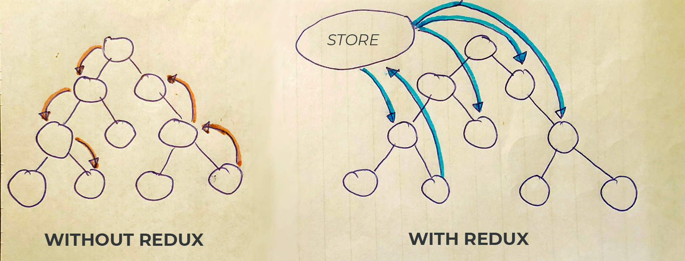
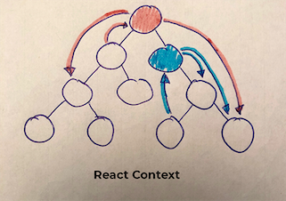
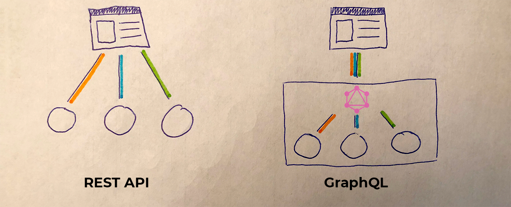
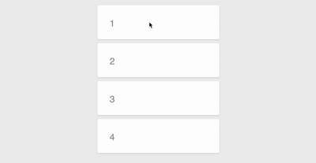
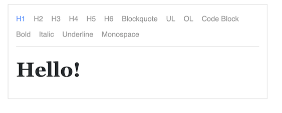
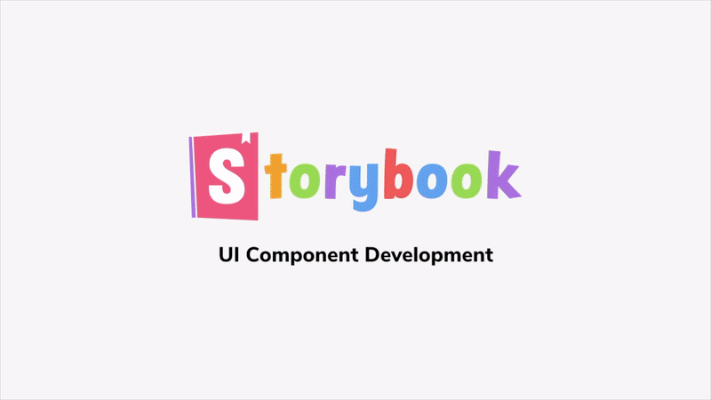

Za posledný rok som sa stretol s množstvom knižníc, ktoré sa týkajú Reactu.
Je to dané najmä tým, že som nemal veľké predchádzajúce skúsenosti s ním
a zároveň javascript je tak rýchly jazyk, že v ňom vychádza každý deň
nové množstvo knižníc.
Rád by som si tu odložil doterajšie skúsenosti a priblížil vám, čo všetko považujem
dnes za nevyhnutné vedieť pri práci s Reactom. Knižnice môžu pomôcť hlavne tým, ktorí
s ním začínajú. Začiatok som absolvoval s oficiálnym [tutoriálom](https://reactjs.org/tutorial/tutorial.html). Keď
si človek uchopí základné pojmy a zistí, ako približne [štruktúrovať React projekt](https://reactjs.org/docs/faq-structure.html), potrebuje dostať nejaký background k aktuálnym populárnym knižniciam.
Tu je zoznam knižníc, ktoré považujem za dôležité.

> Don’t overthink it.
> If you’re just starting a project, don’t spend more than five minutes on choosing a file structure.
>
> <cite>React</cite>

## Boilerplate

[create-react-app](https://github.com/facebook/create-react-app) -
ak nemáte skúsenosti s Reactom, táto knižnica vám vytvorí boilerplate (kostra projektu) pre vašu
aplikáciu. Obsahuje všetky nevyhnutné konfigurácie a závislosti, aby ste mohli
rovno písať React a nemuseli sa o nič starať. Na začiatku veľa súvislostí ešte nemusíte vedieť. Tento tool sa o to postará.

```no-text
What's included? React, JSX, ES6, TypeScript and Flow syntax support.
```

## State Container

[Redux](https://github.com/reduxjs/react-redux) - ide o _globálny obchod s premennými_. Je vhodný k tomu,
aby ste nemuseli preposielať premennú cez ďalších _x_ komponent do hĺbky. Tak ju
napojíte na globálny obchod. Použitie napríklad: user data, aktuálna téma, stav aplikácie, ...
Používa sa často. Odporúčam si doinštalovať na vyvíjanie [plugin](https://chrome.google.com/webstore/detail/redux-devtools/lmhkpmbekcpmknklioeibfkpmmfibljd?hl=en) do chrome.
Ak sa chcete vyhnúť boilerplate (bez akcií, switchov, ...), ktorý je spojený s Reduxom, odporúčam [rematch](https://github.com/rematch/rematch).



[React Context](https://reactjs.org/docs/context.html) - je to pomerne nová feature od Reactu.
Je teoretickým nahraditeľom Reduxu. Tu sa ale vytvorí `provider` dát a
jeho vnútorné komponenty vo vnútri ich vedia čítať pomocou `consumera`.



[MobX](https://github.com/mobxjs/mobx) - ďalšia možnosť stavového kontajneru.

## Úložisko

[store.js](https://github.com/marcuswestin/store.js/) - pomáha pri aplikáciách založených na local storage. Staršie iPhone telefóny ho nepodporujú 😅.

## Serverová komunikácia

[fetch](https://developer.mozilla.org/en-US/docs/Web/API/Fetch_API) - natívny príkaz z ES6,
ktorým je možné dopytovať server. Chýbajú mu zatiaľ nejaké funkcie ako napríklad **abort**.

[Axios](https://github.com/axios/axios) - rozšírená verzia **fetch**, založená
na XMLHttpRequests.

```javascript{numberLines: true}
const axios = require('axios')
axios
  .get('/user?ID=12345')
  .then(function(response) {
    console.log(response)
  })
  .catch(function(error) {
    console.log(error)
  })
```

[Ky](https://github.com/sindresorhus/ky) - kolega poradil prácu s touto knižnicou, ktorý je založený na fetch. Porovnanie autora Axios vs Ky.

> Yes. Axios is based on XMLHttpRequests, while Ky is based on Fetch. Axios has manually implemented a lot of things we get for free with Fetch. Fetch-based libs should be more stable and less buggy in general. Ky also has retry functionality.
>
> <cite>[Sindre Sorhus](https://twitter.com/sindresorhus/status/1037763588826398720)</cite>

[Apollo Client](https://github.com/apollographql/apollo-client) - knižnica s plnou podporou
pre [GraphQL](https://graphql.org/). Ponúka tiež [dev tools](https://chrome.google.com/webstore/detail/apollo-client-developer-t/jdkknkkbebbapilgoeccciglkfbmbnfm) pre Chrome.
Odporúčam si to pozrieť. **GraphQL** v skratke: Viacero dopytov je možné zlúčiť do jedného,
alebo namiesto reťazových volaní na server ich je možné nahradiť za jeden.



## CSS

[Styled Components](https://github.com/styled-components/styled-components) - vizualizácia
komponentov v javascripte pomocou CSS. Výhodou je napríklad vyhnutie sa class-name konfliktov.

```javascript{numberLines: true}
const Button = styled.a`
  display: inline-block;
  color: #e62076;
`
render(<Button href="http://www.martinboksa.eu/">GitHub</Button>)
```

[CSS-in-JS](https://cssinjs.org/) - podobná knižnica ako _Styled Components_, používame ju v práci.

[classnames](https://github.com/JedWatson/classnames) - zaradil som to do CSS, ale ide skôr
o utilitu, ktorá pomáha vytvárať class-names pre komponenty. Je to jeden z mojích
najobľúbenejších nástrojov. Podľa mňa výborne zprehľadní kód.

```javascript
classNames('foo', { bar: true }) // => result class name: 'foo bar'
```

[react-responsive](https://github.com/contra/react-responsive) - jednoduchý spôsob, ako použiť
media query v Reacte a vytvoriť tak responzívny web.

```javascript{numberLines: true}
import MediaQuery from 'react-responsive'
const Example = () => (
  <div>
    <div>Device Test!</div>
    <MediaQuery query="(min-device-width: 1824px)">
      <div>You have a huge screen</div>
    </MediaQuery>
    <MediaQuery query="(max-width: 1224px)">
      <div>You are sized like a tablet or mobile phone though</div>
    </MediaQuery>
  </div>
)
```

[React DnD](https://github.com/react-dnd/react-dnd) - knižnica k vytvoreniu
Drag&Drop rozhrania.

[react-beautiful-dnd](https://github.com/atlassian/react-beautiful-dnd) - v práci chalani majú výbornú skúsenosť s týmto _DnD_.

> má to super performance
> a majú dosť veľa examples, čo pokryje väčšinu základných vecí.
>
> <cite>Denis Slávik</cite>

[React Spring](https://github.com/react-spring/react-spring) - knižnica na animácie. Mám veľmi dobrú skúsenosť s výkonom,
aký je možný s ňou dosiahnúť. Odporúčam
si pozrieť [_"Prečo React potrebuje ďalšiu knižnicu na animácie?"_](https://blog.usejournal.com/why-react-needed-yet-another-animation-library-introducing-react-spring-8212e424c5ce).



[Semantic UI](https://semantic-ui.com/) - UI framework, ktorým vytvoríte responzívny web. Obsahuje preddefinované dizajny.

[Carbon Components](http://react.carbondesignsystem.com/) - Kolekcia rôznych UI hotových komponentov od IBM.

[Fabric](https://developer.microsoft.com/en-us/fabric#/components) - Rôzne komponenty od Microsoftu.

_Tu chýbajú knižnice ako React Bootstrap alebo Material UI, boli vyberané skôr tak, aby sa vám podarilo vytvoriť pekný web čo najjednoduchšie 📚._

## Preklady

[React Intl](https://github.com/yahoo/react-intl) - knižnica na preklady, ktorá okrem iného poskytuje
formátovanie dátumov, čísel, reťazcov, pluralizácie, ...

[react-i18next](https://github.com/i18next/react-i18next) - internacionalizácie pre _reactjs_ / _reactnative_, ktorý je založený na i18next.

[React Intl Redux](https://github.com/ratson/react-intl-redux) - preklady sa držia v redux store.

[FBT](https://facebookincubator.github.io/fbt/) - framework na preklad, ktorý používa Facebook.

_V tejto časti som písal hlavne zo skúsenosti kolegov._

## Testovanie

[Jest](https://jestjs.io/en/) - testovacia platforma s nulovou konfiguráciou. Používa ho tiež _Facebook_.

[Enzyme](https://github.com/airbnb/enzyme) - testovací nástroj od _Airbnb_.

## Meta Tags

[React Document Title](https://github.com/gaearon/react-document-title) - nastavenie `javascript÷document.title`.

[React Helmet](https://github.com/nfl/react-helmet) - nástroj na správu hlavičiek `html÷<head>`.

## Formuláre

[Redux Form](https://github.com/erikras/redux-form) - Drží formuláre v state containeri. Treba poznať [HOC](https://reactjs.org/docs/higher-order-components.html) a [Redux](https://github.com/reduxjs/react-redux).

[Formik](https://jaredpalmer.com/formik) - kompletné riešenie pre formuláre, vrátane validácie, ... Jedno z najpopúlárnejších riešení, ktoré poradil aj [Facebook](https://reactjs.org/docs/forms.html#fully-fledged-solutions).

## Utility

[lodash](https://lodash.com/docs/4.17.11) - rozširuje javascript o veľa zaujímavých funkcií ako _debounce_.

[Moment.js](https://momentjs.com/) - parsovanie, manipulácia a zobrazovanie dátumu a času 📅. Existuje veľa ďalších možností na prácu s dátumom.
Myslím si, že [nie je to úplne dobrá utilita](https://hackernoon.com/why-you-should-choose-date-fns-over-moment-js-in-your-nodejs-applications-116d1a709c43), ale je populárna a známa.

[date-fns](https://date-fns.org/) - namiesto _momentjs_ môžete použiť túto knižnicu.

> Good library if you’re looking to replace Moment.js for one reason or another. Immutable too.
>
> <cite>[Dan Abramov](https://twitter.com/dan_abramov/status/805030922785525760?lang=en)</cite>

## Rich Editor

[Draft.js](https://github.com/facebook/draft-js) - framework s ktorým je možné
vytvoriť _rich editor_. 

## Type Checking

[PropTypes](https://www.npmjs.com/package/prop-types) - kontrola typu _props_ v runtime.

[flow](https://flow.org/en/docs/frameworks/react/) - statický typechecker.

[TypeScript](https://www.typescriptlang.org/) - jazyk, ktorý sa prekladá do javascriptu, ale je typový. Odporúčam si ho pozrieť.

## Nice to know

[Storybook](https://github.com/storybooks/storybook) - developerské rozrahnie pre UI komponenty. Vidíte, ako vyzerajú vaše komponenty . Jeden z dôsledkov použitia Storybook je že komponenty sa dajú lepšie znovu použiť a testovať. Pekný príklad použitia s [Twitterom](https://saurabhnemade.github.io/react-twitter-embed/?selectedKind=Twitter%20Timeline%20Embed&selectedStory=Timeline%20Profile%20%28With%20Screen%20Name%29&full=0&addons=1&stories=1&panelRight=1&addonPanel=storybook%2Factions%2Factions-panel).


[Prettier](https://prettier.io/) - jeden z mojích ďalších obľúbených nástrojov. Slúži ako formátovač kódu, snáď všetky známe editory ho integrujú. Stačí stlačiť klávesovú skratku a naformátuje dokument.

[ESLint](https://eslint.org/) - _The pluggable linting utility for JavaScript and JSX._ Vo všetkých mojich projektoch som ho používal. Niekedy je otravný :).

[TSLint](https://palantir.github.io/tslint/) - Ako ESLint ale pre TypeScript, na statickú analýzu kód.

[PixiJS](http://www.pixijs.com/) - posledný rok som pracoval na grafickom editore, v ktorom bol použitý PixiJS. Môžem plne odporučiť pri práci s plátnom (canvasom).

[Gatsby](https://www.gatsbyjs.org/) - pomáha vytvárať jednoducho stránky bez _"headache"_. Je v ňom napísaný napríklad [React Docs](https://reactjs.org/docs/getting-started.html) alebo tento blog.

[SENTRY](https://sentry.io/welcome/) - tool, ktorý som používal na zachytávanie chýb v produkcii. Môžem odporučiť, výborne sa dá skombinovať s Reactom, najmä ešte keď pridali [Error Boundaries](https://reactjs.org/docs/error-boundaries.html) v metóde `javascript÷componentDidCatch()`.

---

Knižníc a utilít na prácu s Reactom a javascriptom je naozaj veľa. Myslím, že toto je len zlomok zoznamu, ktorý by vám mohol byť užitočný.
Ďalších veľa knižníc môžete pozrieť [tu](https://github.com/brillout/awesome-react-components). Knižnice, ktoré si vyberiete sú na vás. Záleží veľmi od toho,
čo chcete docieliť, ale ja som zástanca toho, aby sme nevymýšľali druhýkrát koleso. Všetky knižnice sú _opensource_ a prípadne prerobenie ich, nemusí byť tak náročné.

Keď som písal blog, premýšľal som o tom, komu tento článok smerovať. Rozhodol som sa nakoniec pre ľudí, ktorí nemajú veľkú skúsenosť s Reactom. Dôsledkom toho som sa rozhodol nepopisovať nástroje ako _webpack_, _parcel_, _grunt_, ... Myslím, že to sú veci, ktoré na začiatku nie sú potrebné.
